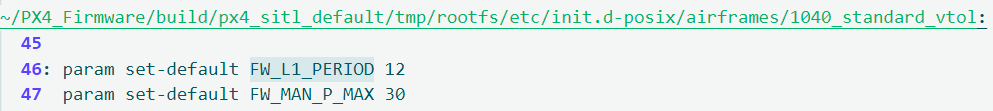

# vtol_keyboard_control.py使用方法：
python3 vtol_keyboard_control.py sandard_vtol 1 vel
三个参数standard_vtol指定机型，1设置飞机数量，vel表示控制类型为速度控制
无人机控制代码参考该文件编写

# 使用键盘控制无法切换至OFFBOARD模式
法一：
在终端输入./QGroundControl.AppImage命令打开地面站，点击左上角地面站图标->Vehicle Setup->Parameters->Search COM_RCL_EXCEPT->勾选Offboard->Save
法二：
地面站左上角图标->Application Settings->General->找到Virtual joystick并勾选

# 常用命令
rostopic list查看当前话题
rostopic echo [topicname]查看话题中的消息
rostopic type [topicname]查看话题中消息的数据类型

# SET_POSITION_TARGET_LOCAL_NED coordinate frame 0 unsupported
在通信python文件 Communication类的初始化中加入以下代码
self.target_motion.coordinate_frame = self.coordinate_frame

# standard_vtol FW_L1_PERIOD = 12

# rostopic list
/clock

/gazebo/zhihang/standard_vtol/local_position

/standard_vtol_0/mavros/local_position/pose

/xtdrone/standard_vtol_0/cmd
/xtdrone/standard_vtol_0/cmd_accel_enu
/xtdrone/standard_vtol_0/cmd_accel_flu
/xtdrone/standard_vtol_0/cmd_pose_enu
/xtdrone/standard_vtol_0/cmd_pose_flu
/xtdrone/standard_vtol_0/cmd_vel_enu
/xtdrone/standard_vtol_0/cmd_vel_flu